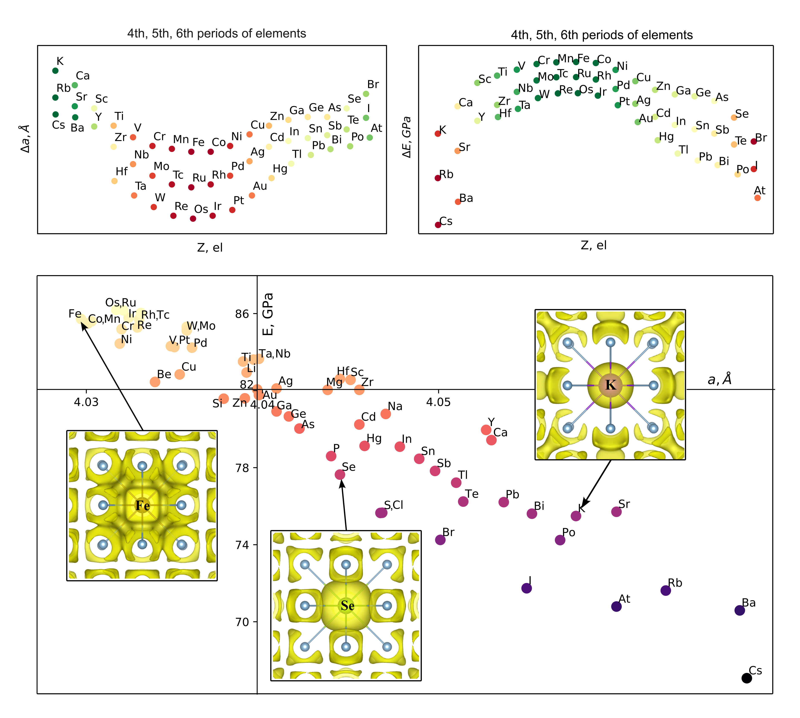

# Dataset from article Data-driven study of dilute Aluminum alloys

#### In this repository you can find data from article Data-driven study of dilute Aluminum alloys. 

The development of new high-tech aluminum alloys is an important and actual task. Modern theoretical methods make it possible to obtain data on the material’s properties, allowing to determine the search area for optimal alloying elements or their combinations for specific applications. Using the PAW method, we systematically studied the properties of binary dilute aluminum alloys with 58 alloying components with an impurity concentration of 1 at.%. For each alloy, lattice parameter a, bulk modulus B, elastic constants C11, C12, C44, Young's modulus E, and shear modulus G were calculated. Ductility characteristics were analyzed using the G/B ratio and the Cauchy pressure PC. Good agreement between the obtained results and experimental data is shown. The influence of alloying components on the mechanical properties of alloys has been evaluated. For a deeper understanding of the discovered dependencies, charge density change analysis of aluminum alloys was carried out.

### Content
This repository contains four files in data folder with datasets on binary Al alloys:

1) `lattice_parameter.csv` - lattice parameter data in Angstroms.
2) `elastic_constants.csv` - elastic constants data in GPa.
3) `elastic_modules.csv` - elastic modules data in GPa.
4) `deformation_radiuses.csv` - data of structural deformations in 1-4 coordination sphere in Angstroms.